# CodeInsight Architecture

## 1. High-Level System Architecture

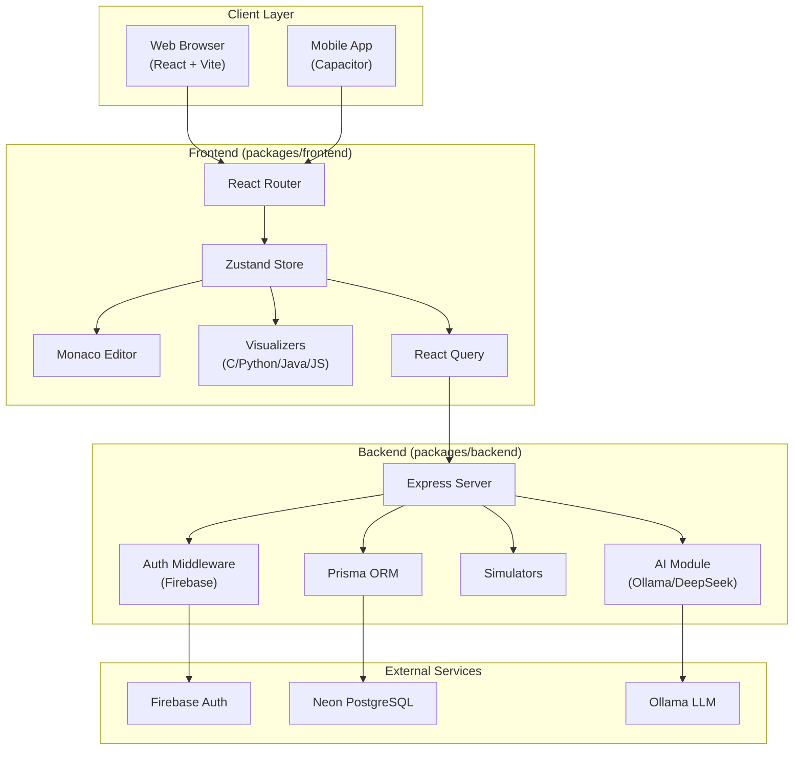

## 2. Monorepo Structure

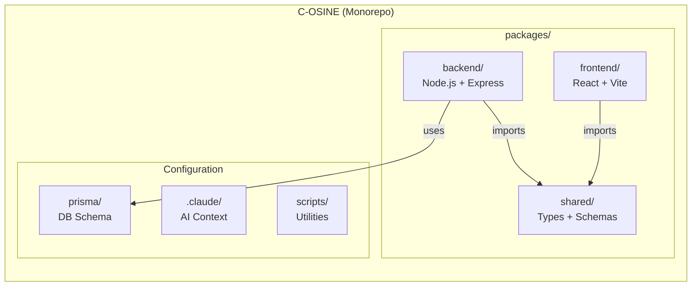

## 3. Frontend Architecture

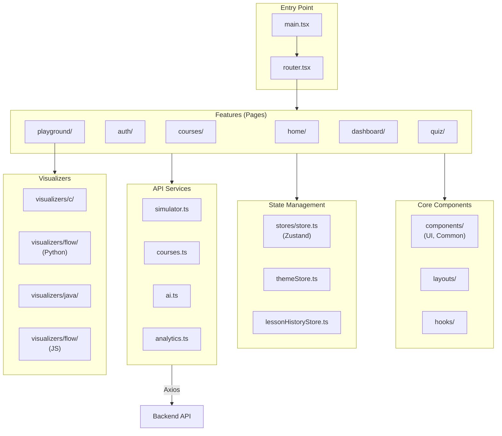

## 4. Backend Architecture

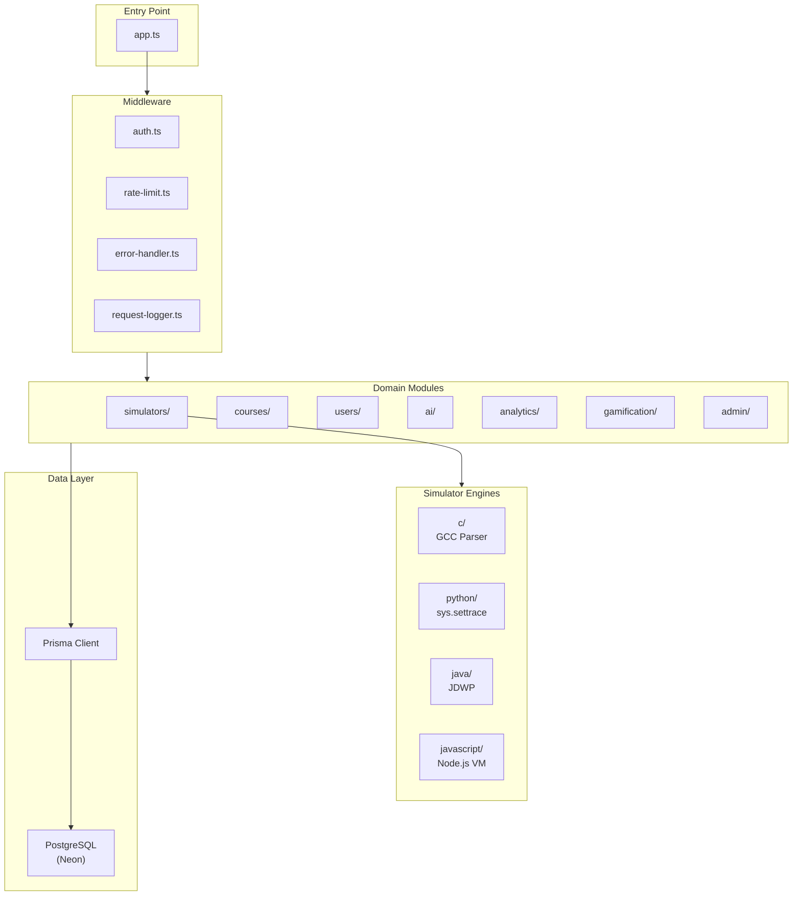

## 5. Simulator Architecture

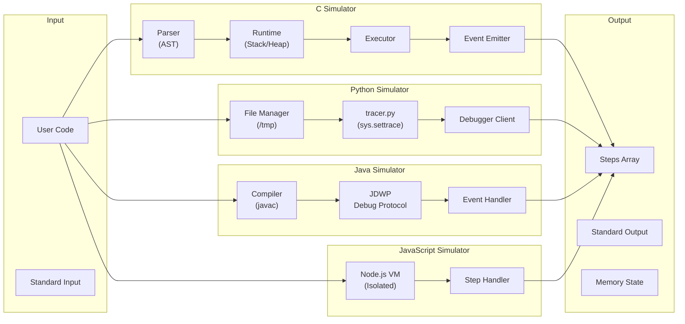

## 6. Database Schema (ERD)

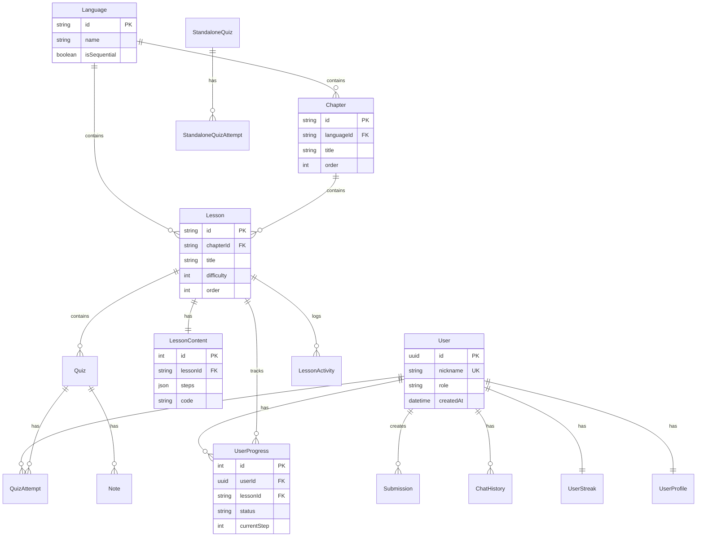

## 7. Code Execution Flow

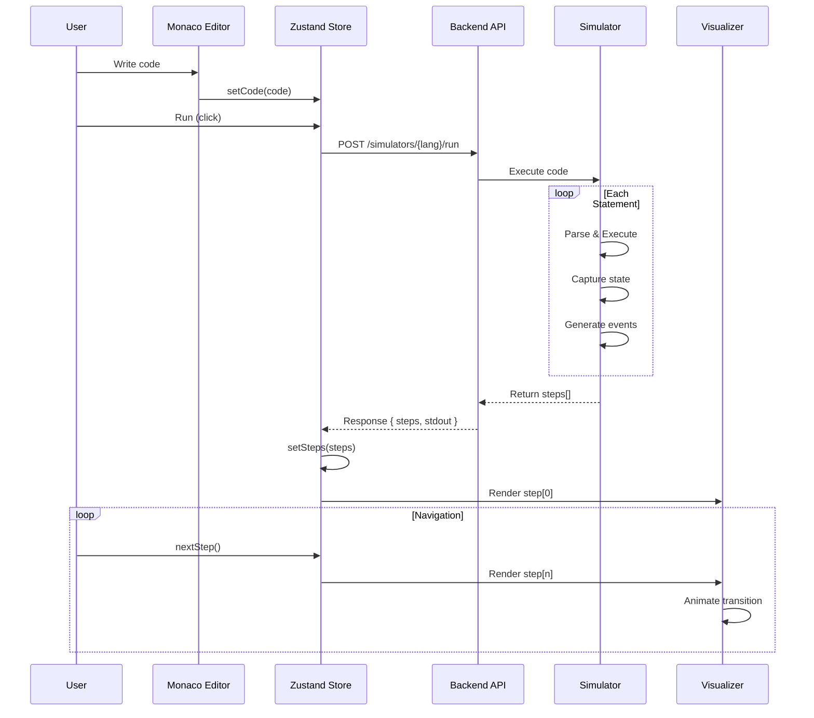

## 8. Authentication Flow

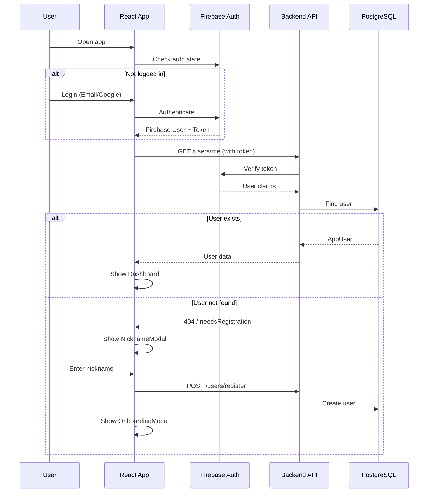

## 9. Course Navigation Flow

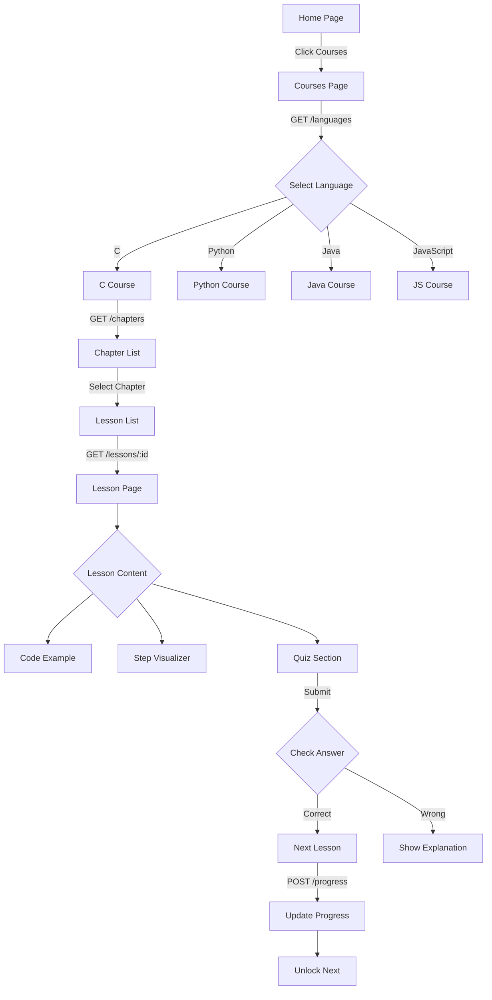

## 10. State Management (Zustand)

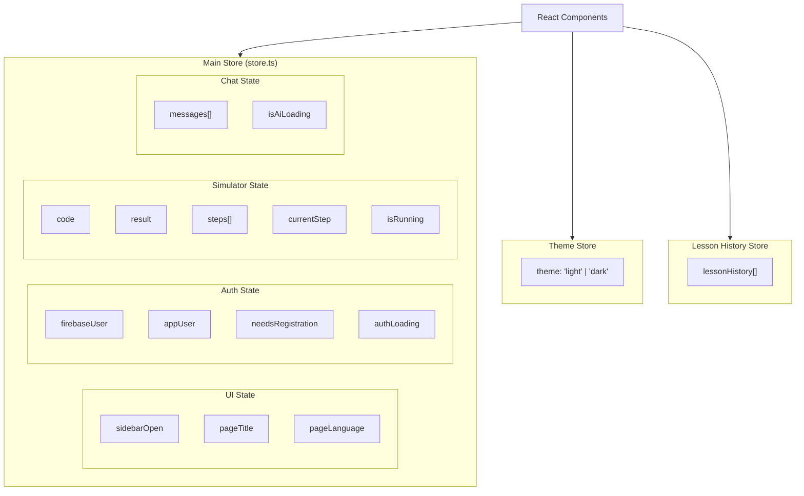

## 11. API Routes Overview

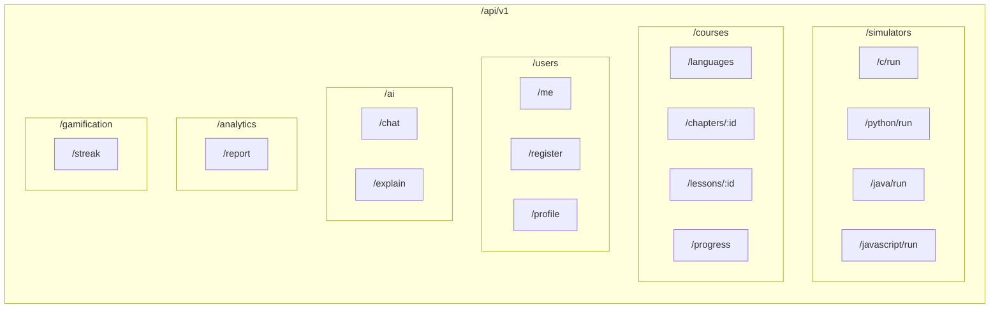

## 12. Deployment Architecture

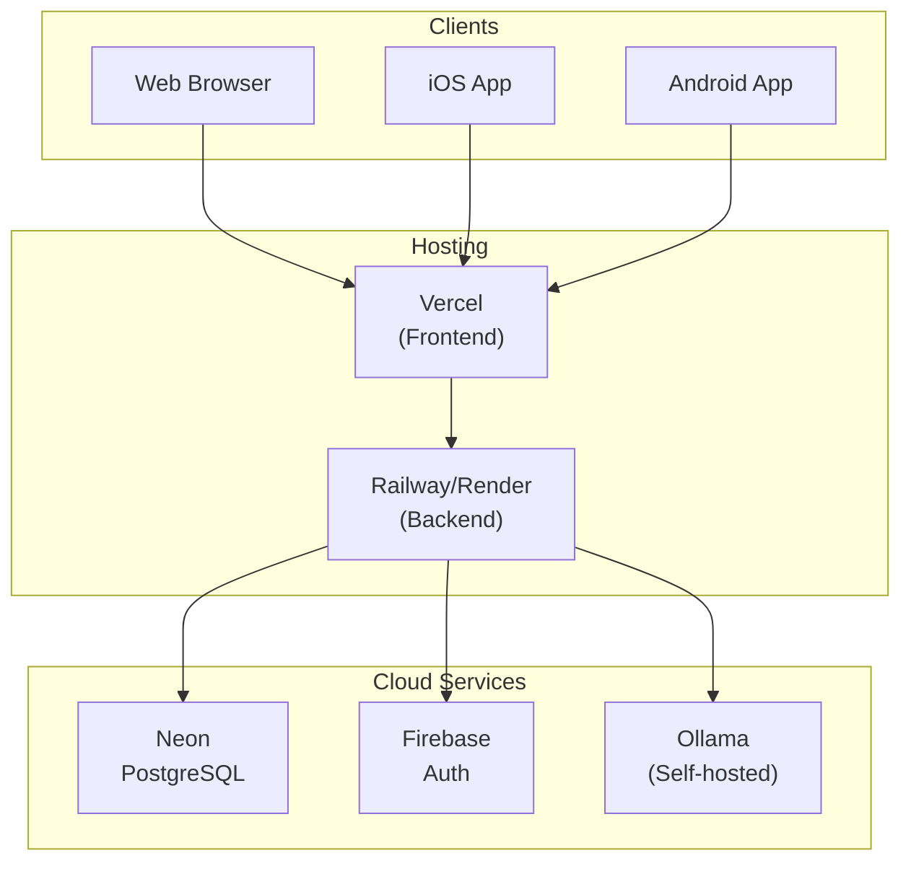

## 13. Visualizer Component Hierarchy

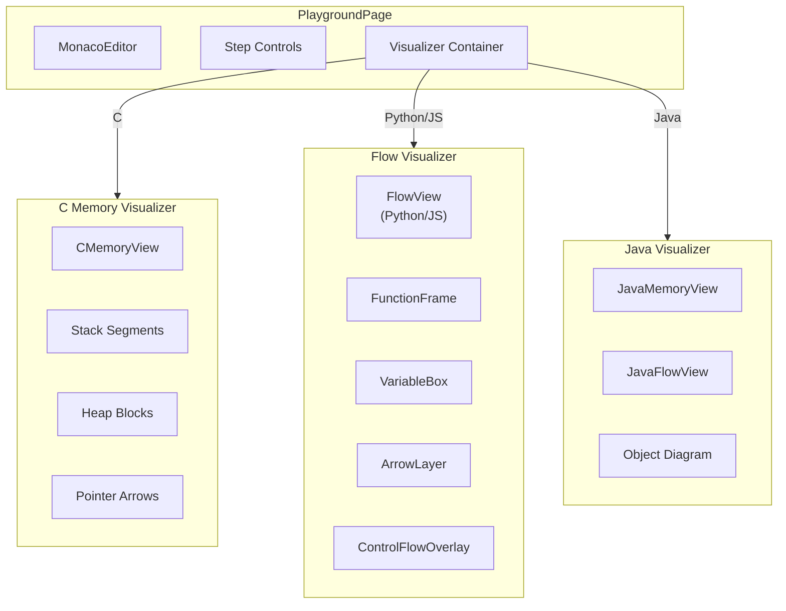

## 14. Tech Stack Summary

| Layer | Technology | Purpose |
|-------|------------|---------|
| **Frontend** | React 19, Vite | UI Framework |
| | TailwindCSS | Styling |
| | Zustand | State Management |
| | React Query | Server State |
| | Monaco Editor | Code Editor |
| | Framer Motion | Animations |
| | Capacitor | Mobile Bridge |
| **Backend** | Express 5 | Web Framework |
| | Prisma | ORM |
| | Zod | Validation |
| | Winston | Logging |
| **Database** | PostgreSQL (Neon) | Primary DB |
| **Auth** | Firebase | Authentication |
| **AI** | Ollama/DeepSeek | LLM Integration |
| **Simulators** | GCC, sys.settrace, JDWP, VM | Code Execution |
