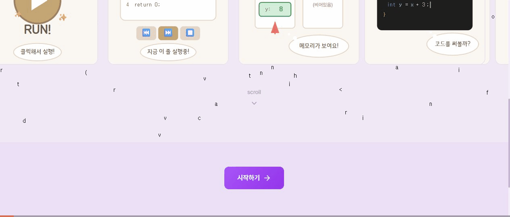

<div align="center">

<h1>
  
</h1>

**코드가 어떻게 실행되는지, 눈으로 직접 확인하세요.**

*Watch your code come alive — memory, variables, and call stacks visualized step by step.*

<br />

[](https://react.dev)
[](https://www.typescriptlang.org)
[](https://nodejs.org)
[](https://www.postgresql.org)
[](https://firebase.google.com)
[](LICENSE)

<br />

**[🚀 Live Demo](https://codeinsight.online)** · **[📖 Docs](#getting-started)** · **[🐛 Issues](https://github.com/jammy0903/C-OSINE/issues)**

<br />



</div>

---

## What is CodeInsight?

코드를 처음 배울 때 가장 어려운 건 **"코드가 실제로 어떻게 실행되는가"** 입니다.

CodeInsight는 코드 한 줄 한 줄이 실행될 때 메모리, 변수, 콜 스택이 어떻게 변하는지를 **시각적으로** 보여주는 학습 플랫폼입니다. C, Python, JavaScript, Java 모두 지원합니다.

```
코드 작성  →  단계별 실행  →  메모리 변화 시각화  →  AI 해설  →  퀴즈로 확인
```

---

## Features

### 시각화 엔진

| 언어 | 시각화 항목 |
|------|------------|
| **C** | 스택/힙 메모리, 포인터, 제어 흐름, 함수 프레임 |
| **Python** | 변수 스코프, 참조 그래프, 단계별 실행 |
| **JavaScript** | 이벤트 루프, 프로토타입 체인, 스코프, Promise, `this` 바인딩 |
| **Java** | JVM 메모리 모델, 객체 참조 |

### 학습 시스템

- **Lesson 모드** — 미리 설계된 커리큘럼을 단계별 가이드와 함께 학습
- **Playground 모드** — 직접 코드를 작성하고 실시간으로 시각화
- **알고리즘 시각화** — 배열, 그래프, 정렬 알고리즘 시각화
- **퀴즈** — 레슨 후 이해도 확인 퀴즈 (O/X, 객관식)
- **AI 해설** — 각 실행 단계마다 AI가 자동으로 설명

### 플랫폼

- **진도 추적** — 학습 스트릭, 완료 기록, 분석 리포트
- **다크/라이트 테마** — 시스템 설정 연동
- **다국어** — 한국어 / English
- **소셜 로그인** — Google, GitHub, Kakao
- **모바일 지원** — iOS/Android (Capacitor)

---

## Tech Stack

```
packages/
├── frontend/     React 19 + Vite + TailwindCSS + Zustand + React Query
├── backend/      Node.js + Fastify + Prisma ORM
├── shared/       TypeScript 공유 타입 & 스키마
└── simulators/   언어별 코드 실행 엔진 (Docker 격리)
```

| Layer | Technology |
|-------|------------|
| Frontend | React 19, Vite, TailwindCSS, Zustand, TanStack Query, Framer Motion |
| Backend | Node.js, Fastify, Prisma ORM, Zod |
| Database | PostgreSQL |
| Auth | Firebase Authentication (Google, GitHub, Kakao) |
| AI | DeepSeek API |
| Simulators | Docker-based execution sandbox |
| Infra | Render (Frontend + Backend + DB) |
| Monorepo | pnpm workspaces + TypeScript |

---

## Java Frame Visualization Flow (Current)

아래 플로우는 현재 Java 레슨/플레이그라운드에서 함수 프레임이 시각화되는 실제 경로를 나타냅니다.

```mermaid
flowchart TD
  A[User Java Code<br/>Main + user classes] --> B[Backend API<br/>POST /api/v1/simulators/java/simulate]
  B --> C[JavaSimulationService]
  C --> D[DebuggerAgent (JDI STEP_INTO)]
  D --> E[SnapshotMaker]
  E --> F[Snapshots JSON<br/>stack[methodName, variables], heap]
  F --> G[Frontend javaSimulator.ts<br/>steps -> LessonStep]
  G --> H[LessonFlowVisualizer<br/>language=java]
  H --> I[JavaTransformer]
  I --> J[FlowStep<br/>variables + frames]
  J --> K[JavaReferenceView]
  K --> L[Rendered Stack Frames<br/>main, &lt;init&gt;, showInfo, deposit, withdraw ...]

  D -. excludes .-> X[java.*, javax.*, jdk.*, sun.*, com.sun.*]
```

---

## Getting Started

### Prerequisites

- Node.js >= 18
- pnpm >= 8
- PostgreSQL
- Docker (시뮬레이터 실행용)
- Firebase 프로젝트

### Setup

```bash
# 클론
git clone https://github.com/jammy0903/C-OSINE.git
cd C-OSINE

# 의존성 설치
pnpm install

# 환경변수 설정
cp .env.example .env
# .env 파일을 열어서 DB URL, Firebase 설정 등을 입력하세요

# DB 마이그레이션 & 시드
cd packages/backend
npx prisma migrate dev
npx prisma db seed
cd ../..

# 개발 서버 시작
pnpm dev
```

개발 서버:
- Frontend → `http://localhost:5174`
- Backend API → `http://localhost:3002`

### Environment Variables

| Variable | Description |
|----------|-------------|
| `DATABASE_URL` | PostgreSQL 연결 문자열 |
| `FIREBASE_PROJECT_ID` | Firebase 프로젝트 ID |
| `FIREBASE_CLIENT_EMAIL` | Firebase 서비스 계정 이메일 |
| `FIREBASE_PRIVATE_KEY` | Firebase 서비스 계정 키 |
| `DEEPSEEK_API_KEY` | DeepSeek AI API 키 |
| `VITE_API_URL` | 프론트엔드에서 사용할 백엔드 URL |

전체 목록은 [`.env.example`](.env.example) 참고.

### Commands

```bash
pnpm dev          # 전체 개발 서버 실행
pnpm build        # 전체 프로덕션 빌드
pnpm test         # 전체 테스트 실행
pnpm clean        # 빌드 아티팩트 삭제
```

---

## Contributing

PR 환영합니다! 기여 전 [CONTRIBUTING.md](CONTRIBUTING.md)를 먼저 읽어주세요.

```bash
git checkout -b feat/your-feature
# 작업 후
git commit -m "feat: describe your change"
git push origin feat/your-feature
# GitHub에서 PR 생성
```

---

## License

[MIT](LICENSE) © [jammy0903](https://github.com/jammy0903)
