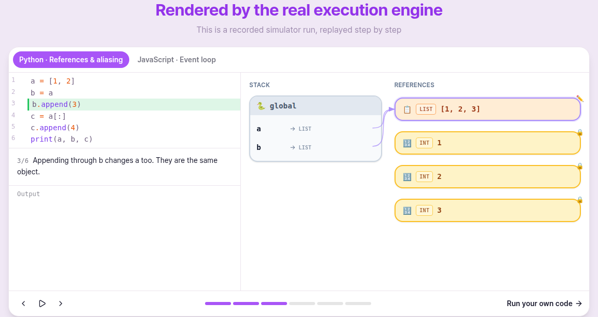
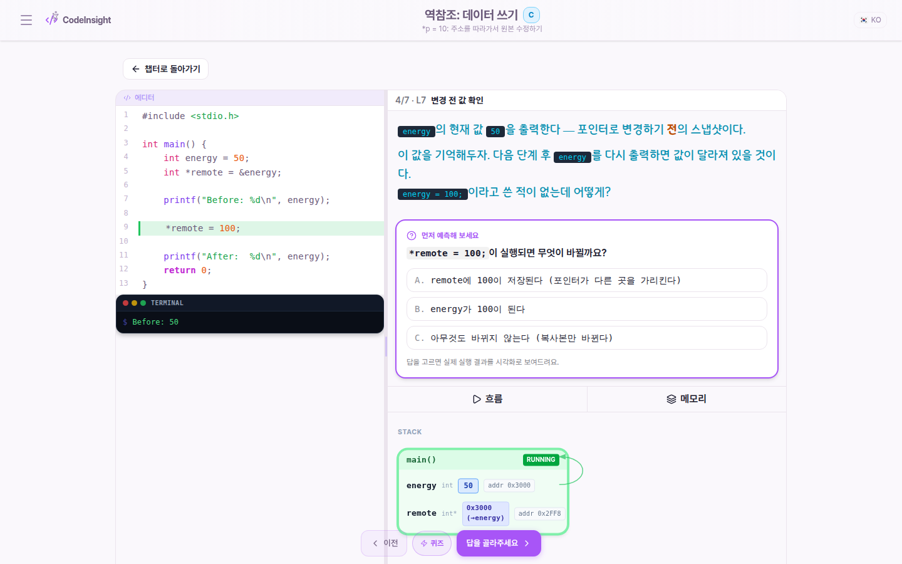
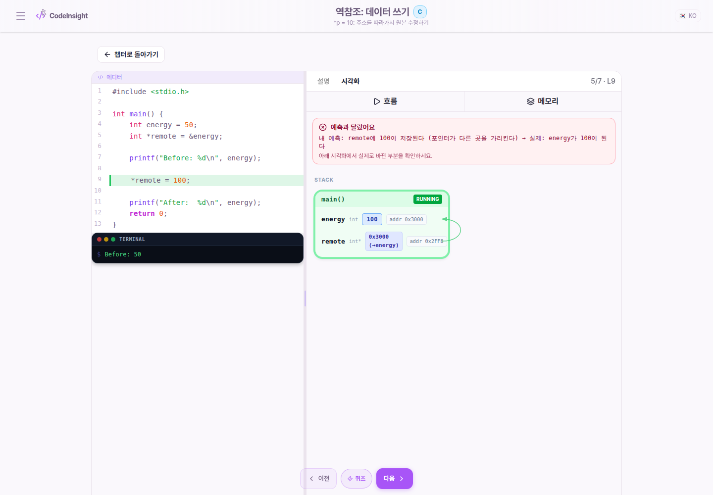
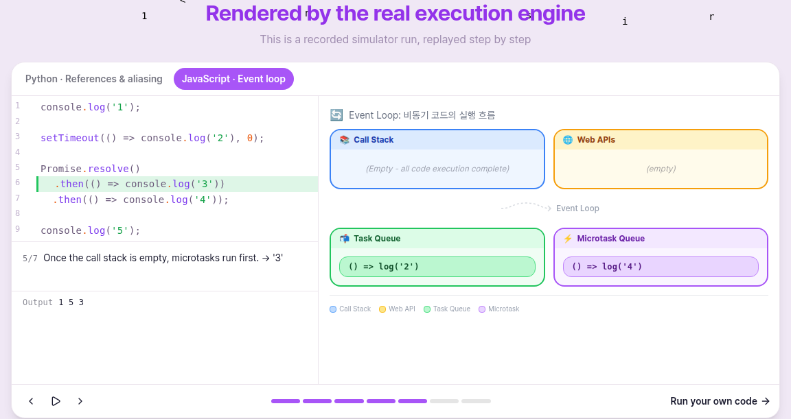
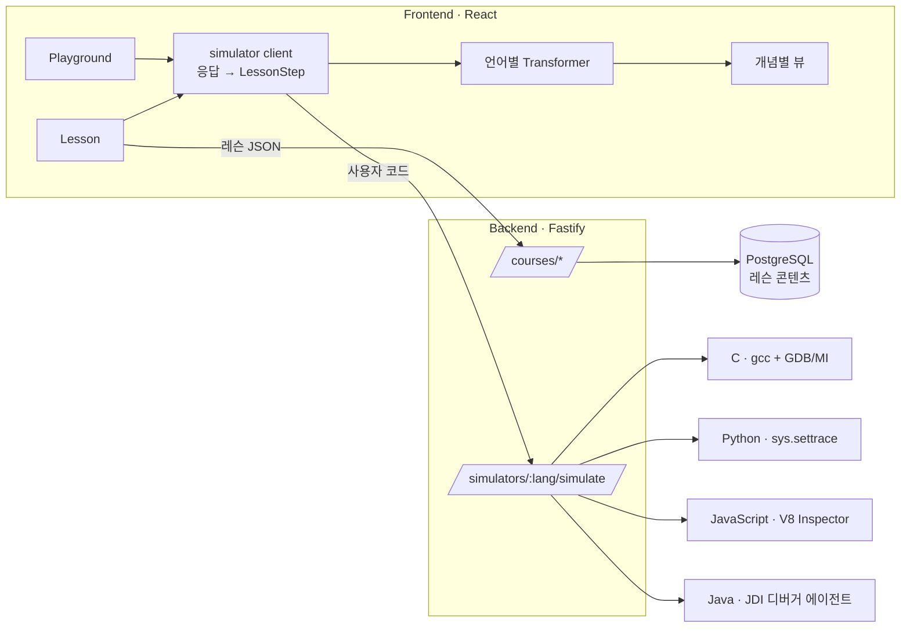

# CodeInsight

**코드를 실제로 실행해서, 메모리와 실행 흐름이 어떻게 바뀌는지 한 단계씩 보여주는 학습 도구입니다.**
C · Python · JavaScript · Java를 지원합니다.

*웹사이트로 배포해 운영했으며, 현재는 운영을 종료했습니다. 소스는 MIT 라이선스로 공개되어 있습니다.*



---

## Python Tutor와 무엇이 다른가

코드를 한 줄씩 실행하며 스택과 힙을 그려주는 도구로는 [Python Tutor](https://pythontutor.com)가 대표적입니다.
CodeInsight는 같은 출발점에서 두 가지를 다르게 했습니다.

### 1. 실행 결과를 보기 전에 먼저 예측하게 한다

시각화 라운드에서 오개념이 흔한 줄에 도달하면, 다음 단계로 넘어가기 전에 결과를 먼저 고르게 합니다.
답을 고르면 그 줄이 실행되고, 시각화가 **실제로 무엇이 바뀌었는지** 보여줍니다.

| 예측 | 실행 후 |
|---|---|
|  |  |

질문은 오개념이 가장 흔한 지점에 넣었습니다.

| 레슨 | 질문 |
|---|---|
| C 역참조 쓰기 | `*remote = 100;`이 바꾸는 건 포인터일까, 원본일까? |
| Python 리스트 | `append`는 새 리스트를 만들까? `del` 후 빈자리가 남을까? |
| Java 참조 전달 | 메서드 안에서 필드를 바꾸는 것과 매개변수를 재할당하는 것의 차이 |
| JS 이벤트 루프 | `setTimeout`과 `Promise.then` 중 무엇이 먼저 출력될까? |

### 2. 개념마다 그 개념에 맞는 그림을 쓴다

모든 코드를 "프레임 + 객체 + 화살표" 한 가지 그림으로 그리지 않고, 개념별 전용 뷰를 둡니다.

| 언어 | 전용 뷰 |
|---|---|
| JavaScript | 이벤트 루프(Call Stack · Web APIs · Task/Microtask Queue), Promise 상태, 프로토타입 체인, 스코프, `this` 바인딩 |
| C | 스택 프레임과 포인터 화살표, 반복문 진행 트랙, 분기 진입/스킵 표시 |
| Python | 이름표(변수)와 객체의 참조 그래프, 가변/불변 객체 구분 |
| Java | 호출 스택과 힙 객체, 참조 변수 호버 시 대상 객체 하이라이트 |



---

## 구성

- **레슨**: 4개 언어, 43개 챕터, 202개 레슨 (한국어 · 영어 · 중국어). 설명 라운드 → 시각화 라운드 → 퀴즈 순서로 진행합니다.
- **Playground**: 직접 작성한 코드를 실행하고 같은 시각화로 따라갑니다.
- **계정 없음**: 로그인 없이 모든 기능을 쓸 수 있습니다. 진도와 예측 결과는 브라우저(localStorage)에 저장합니다.

## 아키텍처


```mermaid
flowchart LR
  subgraph Browser[Frontend · React]
    PG[Playground] --> SVC[simulator client<br/>응답 → LessonStep]
    LS[Lesson] --> SVC
    SVC --> AD[언어별 Transformer]
    AD --> VIEW[개념별 뷰]
  end

  subgraph API[Backend · Fastify]
    SIM[/simulators/:lang/simulate/]
    CRS[/courses/*/]
  end

  SVC -- 사용자 코드 --> SIM
  LS -- 레슨 JSON --> CRS
  CRS --> DB[(PostgreSQL<br/>레슨 콘텐츠)]

  SIM --> C[C · gcc + GDB/MI]
  SIM --> PY[Python · sys.settrace]
  SIM --> JS[JavaScript · V8 Inspector]
  SIM --> JV[Java · JDI 디버거 에이전트]
```

| 언어 | 실행 추적 방식 |
|---|---|
| C | gcc로 컴파일한 뒤 GDB/MI로 한 줄씩 진행하며 스택·힙·포인터 스냅샷 수집 |
| Python | `sys.settrace` 기반 에이전트로 이름과 객체 참조를 추적 |
| JavaScript | Node.js V8 Inspector로 스텝 실행하며 스코프와 콜 스택 수집 |
| Java | JDI(Java Debug Interface) 에이전트로 프레임과 힙 객체 수집 |

시뮬레이터는 API 서버의 자식 프로세스로 실행됩니다. 실행 시간 제한, 스텝 상한, 위험 패턴 검사, 최소 환경변수, 요청 속도 제한(IP당 분당 100회)을 적용합니다. 실행 단위 컨테이너 격리는 적용하지 않았습니다.

```
packages/
├── frontend/   React 19 · Vite · TailwindCSS · Zustand · TanStack Query
├── backend/    Fastify · Prisma · 언어별 시뮬레이터 (src/modules/simulators)
└── shared/     프론트·백엔드 공용 Zod 스키마와 타입
```

## 설계에서 내린 결정

- **예측 질문은 시각화 라운드에 둔다.** 답을 고른 직후 시각화가 실제 변화를 보여줘야 예측과 결과의 차이가 눈에 들어옵니다. 이동(버튼 · 키보드 · 스와이프)은 모두 `usePredictGate` 훅을 거치며, 질문 중에는 다음 단계로 넘어가지 않습니다. 각 질문의 첫 답만 기록해, 다시 풀어 맞혀도 오개념 기록이 지워지지 않습니다.
- **홈 데모는 녹화를 재생한다.** 실제 엔진 결과를 `scripts/record-home-demo.mjs`로 녹화해 번들에 넣고, Playground·레슨과 같은 변환 함수로 재생합니다. 백엔드가 잠들어 있어도 첫 화면이 바로 움직입니다.
- **레슨 JSON은 변경분(delta)만 적는다.** 각 단계에는 바뀐 시각화 상태만 쓰고, 서버가 이전 단계 상태와 합쳐 전체 상태로 펼칩니다.
- **이벤트 루프는 사전 제작 데이터를 쓴다.** JS 시뮬레이터는 동기 구간만 추적하므로, microtask와 task의 실행 순서를 보여주는 레슨은 미리 작성한 단계 데이터를 사용합니다.

## 실행하기

**필요한 것**: Node.js 18 이상, pnpm, PostgreSQL. 시뮬레이터를 로컬에서 돌리려면 GCC · GDB, Python 3, JDK 17이 필요합니다.

```bash
git clone https://github.com/jammy0903/CodeInsight.git
cd CodeInsight
pnpm install

# PostgreSQL (Docker 예시)
docker run -d --name codeinsight-db -p 5432:5432 \
  -e POSTGRES_USER=codeinsight -e POSTGRES_PASSWORD=codeinsight123 -e POSTGRES_DB=codeinsight \
  postgres:16

# 스키마 적용 + 레슨 콘텐츠 시드
cd packages/backend
npx prisma migrate deploy
npx prisma db seed
cd ../..

pnpm dev
```

- Frontend → `http://localhost:5174`
- Backend API → `http://localhost:3002`

모든 환경변수에는 기본값이 있어 `.env` 없이 실행됩니다. 바꿀 수 있는 값은 [`.env.example`](.env.example)과 [`packages/backend/.env.example`](packages/backend/.env.example)에 있습니다.

```bash
pnpm build   # 전체 빌드
pnpm test    # 전체 테스트 (C 시뮬레이터 테스트는 gdb 필요)
```

## License

[MIT](LICENSE) © [jammy0903](https://github.com/jammy0903)
