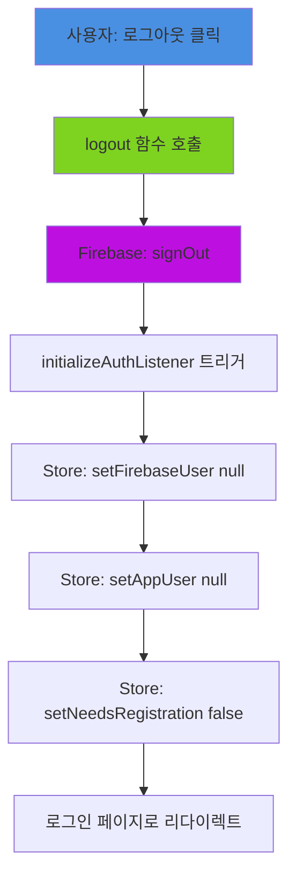
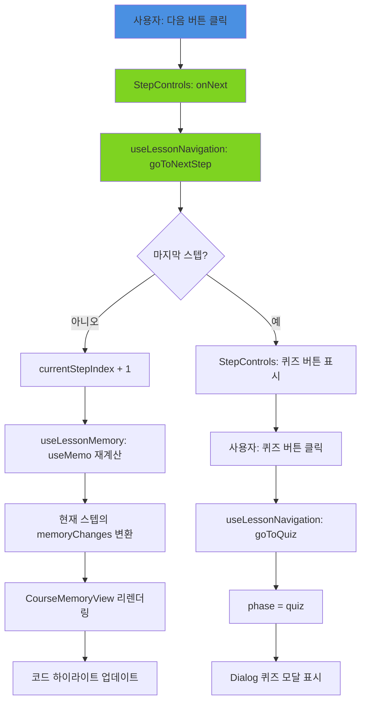
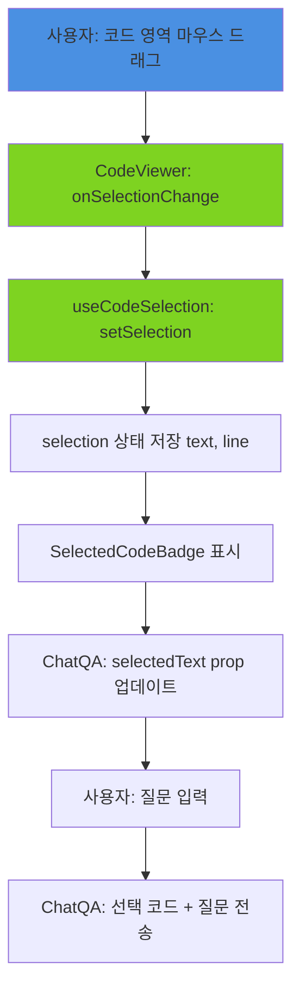
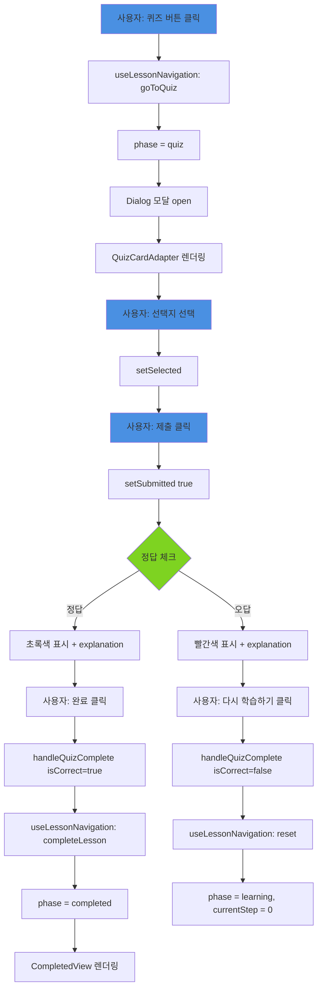
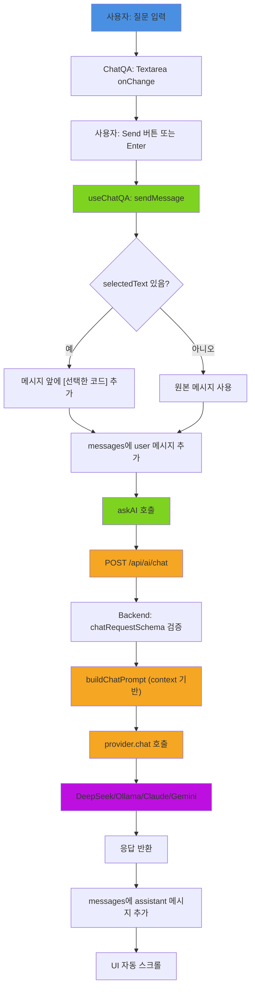
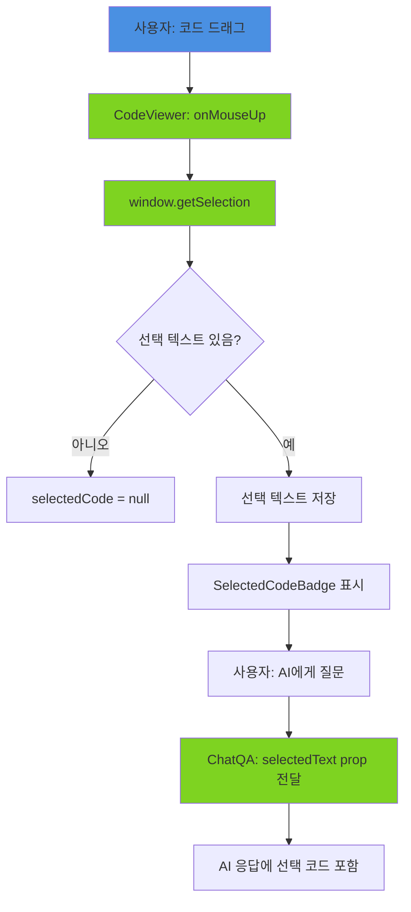
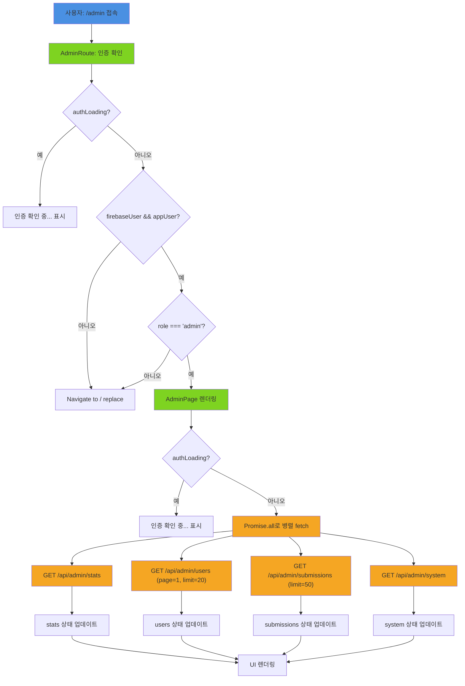
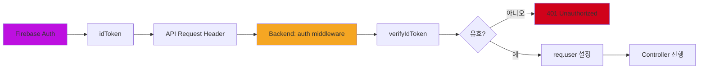
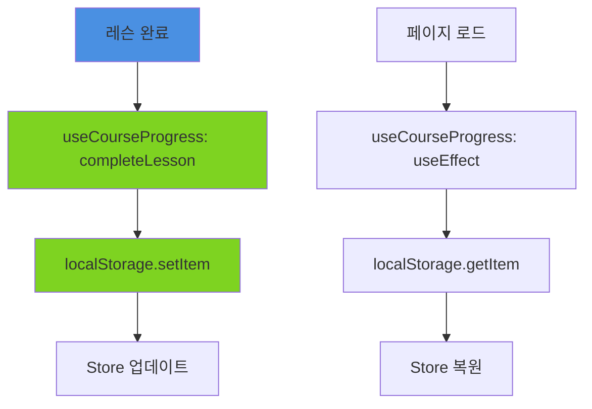

# CodeInsight Task Flows

> **사용자가 할 수 있는 모든 작업과 그 흐름을 시각화합니다.**

---

## 📖 읽는 방법

- **사용자 액션**: 파란색 (클릭, 입력 등)
- **Frontend 처리**: 초록색 (Component, Hook, Store)
- **Backend 처리**: 주황색 (API, Service, DB)
- **외부 서비스**: 보라색 (Firebase, Ollama)

---

## 1️⃣ 인증 관련 (Authentication)

### 1.1 소셜 로그인 (Google/GitHub/Kakao)

```mermaid
graph TD
    A[사용자: 로그인 버튼 클릭] --> B[LoginPage: loginWithGoogle/Github/Kakao]
    B --> C[Firebase: signInWithPopup]
    C --> D{인증 성공?}
    D -->|실패| E[에러 메시지 표시]
    D -->|성공| F[Firebase: User 객체 반환]
    F --> G[initializeAuthListener 트리거]
    G --> H[Store: setFirebaseUser]
    H --> I[getCurrentUser 호출]
    I --> J{백엔드에 사용자 존재?}
    J -->|404 없음| K[Store: setNeedsRegistration true]
    K --> L[NicknameModal 표시]
    J -->|200 있음| M[Store: setAppUser]
    M --> N[/courses로 리다이렉트]

    style A fill:#4A90E2
    style B fill:#7ED321
    style C fill:#BD10E0
    style I fill:#F5A623
```

**관련 파일**:
- Frontend: `LoginPage.tsx`, `services/firebase.ts` (initializeAuthListener), `stores/store.ts`
- Backend: `modules/users/routes.ts` (GET /me)
- DB: `User`, `OAuthAccount`

---

### 1.2 닉네임 등록

```mermaid
graph TD
    A[사용자: 닉네임 입력] --> B[NicknameModal: onChange]
    B --> C[300ms debounce 대기]
    C --> D{빈 값?}
    D -->|예| E[status: idle]
    D -->|아니오| F{형식 검사: 2-20자, 정규식}
    F -->|실패| G[status: invalid, 에러 메시지]
    F -->|통과| H[status: checking]
    H --> I[GET /api/v1/users/check-nickname/:nickname]
    I --> J{중복 검사}
    J -->|사용 중| K[status: invalid, '이미 사용 중']
    J -->|사용 가능| L[status: valid, '사용 가능']
    L --> M[등록 버튼 활성화]
    M --> N[사용자: 등록 클릭]
    N --> O[POST /api/v1/users/register]
    O --> P[Backend: User 생성]
    P --> Q[OAuthAccount 생성 및 연결]
    Q --> R[User 반환]
    R --> S[Store: setAppUser]
    S --> T[Store: setNeedsRegistration false]
    T --> U[NicknameModal 닫기]
    U --> V[/courses로 리다이렉트]

    style A fill:#4A90E2
    style B fill:#7ED321
    style I fill:#F5A623
    style O fill:#F5A623
    style P fill:#F5A623
```

**관련 파일**:
- Frontend: `NicknameModal.tsx` (validateNickname with debounce), `services/user.ts`
- Backend: `modules/users/routes.ts` (GET /check-nickname/:nickname, POST /register)
- DB: `User`, `OAuthAccount`

**주요 특징**:
- 닉네임 최소 **2자** (3자 아님)
- 자동 검사 (300ms debounce, 버튼 클릭 불필요)
- Path parameter 사용 (`/check-nickname/:nickname`)

---

### 1.3 로그아웃



**관련 파일**:
- Frontend: `services/firebase.ts` (logout, initializeAuthListener), `stores/store.ts`

**주요 특징**:
- Store 초기화는 `initializeAuthListener`에서 자동 처리 (onAuthStateChanged)

---

## 2️⃣ 코스 탐색 (Course Navigation)

### 2.1 언어 목록 조회

```mermaid
graph TD
    A[사용자: /courses 접속] --> B[CoursesPage: useEffect]
    B --> C[getLanguages 호출]
    C --> D[GET /api/v1/courses/languages]
    D --> E[Backend: Language 조회]
    E --> F[Language[] 반환]
    F --> G[Zod 검증]
    G --> H{검증 성공?}
    H -->|실패| I[에러 표시]
    H -->|성공| J[언어 카드 렌더링]
    J --> K[사용자: 언어 클릭]
    K --> L[navigate to /courses/:lang]

    style A fill:#4A90E2
    style B fill:#7ED321
    style C fill:#7ED321
    style D fill:#F5A623
    style E fill:#F5A623
```

**관련 파일**:
- Frontend: `CoursesPage.tsx`, `services/courses.ts`
- Backend: `modules/courses/routes.ts` (GET /courses/languages)
- DB: `Language`

---

### 2.2 챕터+레슨 Accordion 조회

```mermaid
graph TD
    A[사용자: /courses/:lang 접속] --> B[LanguageCoursePage: useEffect]
    B --> C[getChapters 호출]
    C --> D[GET /api/v1/courses/:lang/chapters]
    D --> E[Backend: Chapter[] 반환]
    E --> F[Promise.all: 각 챕터의 레슨 조회]
    F --> G[getChapterWithLessons 병렬 호출]
    G --> H[GET /api/v1/courses/chapters/:id 여러 번]
    H --> I[ChapterWithLessons[] 반환]
    I --> J[setChapters]
    J --> K[getUserProgress 호출]
    K --> L[GET /api/v1/courses/progress]
    L --> M{인증됨?}
    M -->|아니오| N[에러 무시 미인증 사용자]
    M -->|예| O[UserProgress[] 반환]
    O --> P[Map으로 변환 lessonId 키]
    N --> Q[ChapterAccordion 렌더링]
    P --> Q
    Q --> R[사용자: Accordion 펼치기]
    R --> S[레슨 목록 + 진행 상태 표시]
    S --> T[사용자: 레슨 클릭]
    T --> U[navigate to /courses/:lang/:lessonId]

    style A fill:#4A90E2
    style B fill:#7ED321
    style C fill:#7ED321
    style D fill:#F5A623
    style H fill:#F5A623
    style L fill:#F5A623
```

**관련 파일**:
- Frontend: `LanguageCoursePage.tsx`, `ChapterAccordion.tsx`, `services/courses.ts`
- Backend: `modules/courses/routes.ts` (GET /courses/:lang/chapters, GET /courses/chapters/:id, GET /courses/progress)
- DB: `Chapter`, `Lesson`, `UserProgress`

**주요 특징**:
- ChaptersPage/LessonsPage 대신 **단일 페이지** (LanguageCoursePage)
- Accordion UI로 챕터/레슨을 한 화면에 표시
- 병렬 요청으로 모든 챕터의 레슨을 한 번에 로드
- **진행 상태는 선택적** (미인증 사용자는 에러 무시)
- URL 구조: `/courses/:lang/:lessonId` (chapterId 없음)

---

## 3️⃣ 레슨 학습 (Lesson Learning)

### 3.1 레슨 상세 조회 + 초기화

```mermaid
graph TD
    A[사용자: /courses/:lang/:lessonId 접속] --> B[LessonPage: useEffect]
    B --> C[getLessonFull 호출]
    C --> D[GET /api/v1/courses/lessons/:id]
    D --> E[Backend: Lesson 조회 + content/quiz 파싱]
    E --> F[LessonFull 반환 chapterId 포함]
    F --> G[Zod 검증]
    G --> H{검증 성공?}
    H -->|실패| I[에러 표시: Invalid lesson data]
    H -->|성공| J[setLesson]
    J --> K[getChapterWithLessons lessonData.chapterId]
    K --> L[GET /api/v1/courses/chapters/:id]
    L --> M[ChapterWithLessons 반환]
    M --> N[lessons.findIndex 현재 레슨]
    N --> O{currentIdx < length - 1?}
    O -->|예| P[setNextLessonId lessons[idx+1].id]
    O -->|아니오| Q[setNextLessonId null]
    P --> R[useLessonNavigation 초기화 phase=learning]
    Q --> R
    R --> S[useLessonMemory 초기화]
    S --> T[useCodeSelection 초기화]
    T --> U[첫 스텝 렌더링 currentStepIndex=0]

    style A fill:#4A90E2
    style B fill:#7ED321
    style D fill:#F5A623
    style E fill:#F5A623
    style L fill:#F5A623
    style I fill:#D0021B
```

**관련 파일**:
- Frontend: `LessonPage.tsx`, `hooks/useLessonNavigation.ts`, `hooks/useLessonMemory.ts`, `services/courses.ts`
- Backend: `modules/courses/routes.ts` (GET /courses/lessons/:id, GET /courses/chapters/:id)
- DB: `Lesson`, `Chapter`

**주요 특징**:
- URL에 chapterId 없음 (`/courses/:lang/:lessonId`)
- 다음 레슨 찾기 위해 챕터 정보 조회
- phase 개념: `learning` → `quiz` → `completed`

---

### 3.2 스텝 진행 (다음 버튼)



**관련 파일**:
- Frontend: `StepControls.tsx`, `hooks/useLessonNavigation.ts`, `hooks/useLessonMemory.ts`

**주요 특징**:
- 각 스텝의 memoryChanges는 **스냅샷** (누적 아님)
- AI 자동 해설은 현재 미구현 (TODO)
- 퀴즈는 마지막 스텝 후 버튼으로 진입

---

### 3.3 메모리 시각화

```mermaid
graph TD
    A[스텝 변경] --> B[useLessonMemory: useMemo 트리거]
    B --> C[현재 스텝의 memoryChanges 가져오기]
    C --> D{memoryChanges 있음?}
    D -->|없음| E[빈 상태 반환]
    D -->|있음| F[convertToVisualFormat 호출]
    F --> G[stack frames 변환]
    F --> H[heap objects 변환]
    G --> I[LessonMemoryBlock[] 생성]
    H --> I
    I --> J[CourseMemoryView에 전달]
    J --> K[Stack 테이블 렌더링]
    J --> L[Heap 테이블 렌더링]
    K --> M[highlight된 블록 강조]
    L --> M

    style A fill:#4A90E2
    style B fill:#7ED321
    style F fill:#7ED321
```

**관련 파일**:
- Frontend: `hooks/useLessonMemory.ts`, `components/memory/CourseMemoryView.tsx`
- Types: `types/index.ts` (StepMemoryState, StackFrame, HeapObject)

**주요 특징**:
- 각 스텝의 memoryChanges는 **전체 메모리 스냅샷**
- 누적 계산 없음 (이전 스텝 상태 무시)
- highlight 속성으로 변경된 블록 표시

---

### 3.4 코드 선택



**관련 파일**:
- Frontend: `hooks/useCodeSelection.ts`, `components/day/CodeViewer.tsx`, `components/day/SelectedCodeBadge.tsx`, `ChatQA.tsx`

**주요 특징**:
- 선택된 코드는 ChatQA에 자동 전달
- Badge 클릭으로 선택 해제 가능

---

## 4️⃣ 퀴즈 풀이 (Quiz)

### 4.1 퀴즈 표시 및 제출



**관련 파일**:
- Frontend: `LessonPage.tsx` (QuizCardAdapter, handleQuizComplete), `hooks/useLessonNavigation.ts`
- Components: `@/components/ui/dialog` (shadcn Dialog)

**주요 특징**:
- 퀴즈는 별도 페이지가 아닌 **Dialog 모달**
- 정답 시: `phase = completed` → CompletedView
- 오답 시: `phase = learning, currentStep = 0` (처음부터 재학습)

---

## 5️⃣ AI 해설자 (AI Chat)

### 5.1 질문 입력 및 응답



**관련 파일**:
- Frontend: `features/chat/components/ChatQA.tsx`, `features/chat/hooks/useChatQA.ts`, `services/ai.ts` (askAI)
- Backend: `modules/ai/routes.ts` (POST /chat, buildChatPrompt), `modules/ai/providers/`
- Context: `{ courseDay?, topic?, code?, currentLine?, quizQuestion? }`

**주요 변경사항**:
- 코드 선택 시 자동으로 메시지에 포함
- Context를 통해 현재 레슨 정보 전달
- 퀴즈 진행 중에는 정답 유출 방지

---

### 5.2 코드 선택 (useCodeSelection)



**관련 파일**:
- Frontend: `features/courses/hooks/useCodeSelection.ts`, `features/courses/components/day/CodeViewer.tsx`, `features/courses/components/day/SelectedCodeBadge.tsx`

---

## 6️⃣ 관리자 (Admin)

### 6.1 관리자 페이지 접근



**관련 파일**:
- Frontend: `features/admin/components/AdminRoute.tsx`, `features/admin/AdminPage.tsx`, `features/admin/components/AIProviderToggle.tsx`
- Store: `stores/store.ts` (firebaseUser, appUser, authLoading)
- Backend: `modules/admin/routes.ts` (/stats, /users, /submissions, /system)

**주요 변경사항**:
- 비인가 사용자는 403 에러가 아닌 홈으로 리다이렉트
- authLoading 대기 후 데이터 fetch
- 4개 API 병렬 호출로 성능 최적화

---

## 📊 주요 데이터 흐름 정리

### Frontend → Backend 인증



### 진행 상태 관리 (현재: LocalStorage)



**TODO**: Phase 2에서 Backend로 이동 예정

---

## 🔴 현재 에러 분석

### memoryChanges.heap 타입 불일치

**발생 위치**: `LessonPage.tsx` → `getLessonFull` → Zod 검증

```
Expected array, received object
at path: content.steps[0].memoryChanges.heap
```

**원인**:
- DB에 저장된 heap 데이터가 객체 형태
- Zod 스키마는 배열을 기대

**해결 방법**:
1. Seed 데이터 수정 (heap을 배열로 변경)
2. 또는 Zod 스키마 수정 (객체도 허용)

**관련 파일**:
- `packages/shared/src/schemas/course.ts`
- `packages/backend/prisma/seed.ts` 또는 `java-content-seed-*.ts`

---

## ✅ 다음 단계

1. [ ] 각 Flow Chart 검증 (실제 코드와 일치 확인)
2. [ ] 에러 케이스 추가 (네트워크 실패, 타임아웃 등)
3. [ ] Notion에 업로드
4. [ ] memoryChanges.heap 에러 수정

