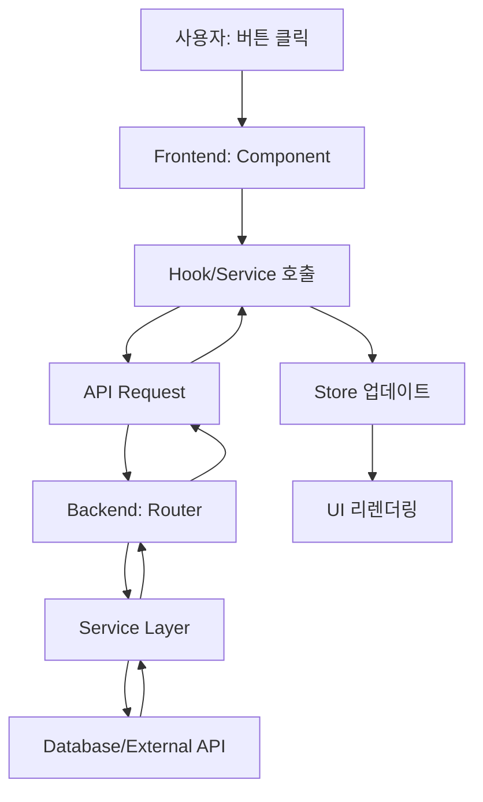

# CodeInsight Task Flows 문서화 계획

> **목표**: 실행되는 모든 사용자 Task를 정리하고, 각각의 Flow Chart를 만들어 시스템을 완전히 이해한다.

---

## 📋 문서화 범위

### 왜 Task 중심으로 정리하는가?
- **사용자 관점**: "이 버튼을 누르면 무슨 일이 일어나는가?"
- **개발자 관점**: "이 기능을 수정하려면 어디를 봐야 하는가?"
- **디버깅 관점**: "에러가 어디서 발생했는가?"

### Flow Chart에 포함될 내용
```
사용자 액션 → Frontend (Component/Hook/Store) → API 호출 → Backend (Router/Service/DB) → 응답 → UI 업데이트
```

---

## 🎯 Task 분류

### 1. 인증 관련 (Authentication)
- [ ] 소셜 로그인 (Google/GitHub/Kakao)
- [ ] 닉네임 중복 확인
- [ ] 닉네임 등록
- [ ] 로그아웃
- [ ] 세션 유지 (Firebase Auth)

### 2. 코스 탐색 (Course Navigation)
- [ ] 언어 목록 조회 (CoursesPage)
- [ ] 챕터 목록 조회 (ChaptersPage)
- [ ] 레슨 목록 조회 (LessonsPage)
- [ ] 진행 상태 로드 (Progress)

### 3. 레슨 학습 (Lesson Learning)
- [ ] 레슨 상세 조회
- [ ] 스텝 진행 (이전/다음)
- [ ] 코드 하이라이트
- [ ] 메모리 시각화 (CourseMemoryView)
- [ ] 코드 선택 (useCodeSelection)
- [ ] AI 자동 해설

### 4. 퀴즈 풀이 (Quiz)
- [ ] 퀴즈 표시
- [ ] 답안 제출
- [ ] 정답/오답 확인
- [ ] 레슨 완료 처리

### 5. AI 해설자 (AI Chat)
- [ ] 질문 입력
- [ ] AI 응답 수신 (스트리밍)
- [ ] 컨텍스트 유지 (현재 레슨)
- [ ] 채팅 히스토리

### 6. 관리자 (Admin)
- [ ] 관리자 페이지 접근 (역할 체크)
- [ ] 사용자 목록 조회
- [ ] 코스 관리 (추가/수정/삭제)
- [ ] 시스템 상태 확인

---

## 📊 Flow Chart 작성 계획

각 Task마다 다음 형식으로 작성:



---

## 🔍 우선순위

### Phase 1: 핵심 학습 플로우 (우선)
1. 레슨 학습 전체 흐름
2. 메모리 시각화
3. 퀴즈 풀이

### Phase 2: 보조 기능
4. 코스 탐색
5. AI 해설자
6. 인증

### Phase 3: 관리
7. 관리자 기능

---

## 📝 작업 진행 상황

- [x] 계획 문서 생성
- [ ] Task 목록 상세화
- [ ] Flow Chart 작성 (Phase 1)
- [ ] Flow Chart 작성 (Phase 2)
- [ ] Flow Chart 작성 (Phase 3)
- [ ] Notion에 업데이트

---

## 📌 참고 문서

- `docs/architecture/SYSTEM_OVERVIEW.md`: 시스템 전체 구조
- `.claude/CLAUDE.md`: 프로젝트 가이드
- `docs/plans/20_remaining_tasks.md`: 남은 작업
