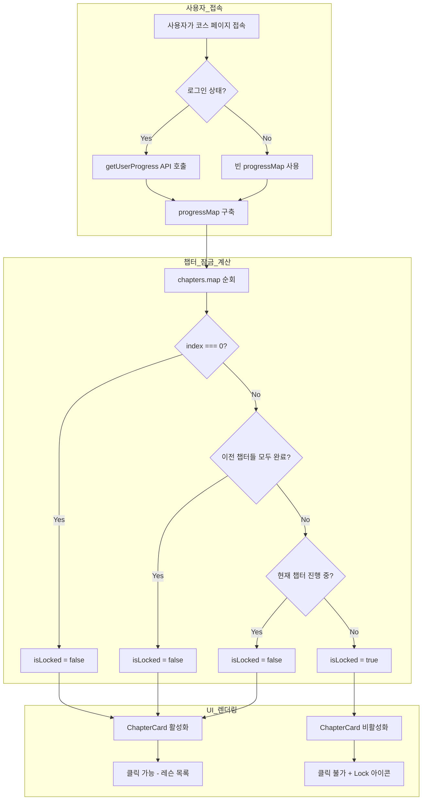
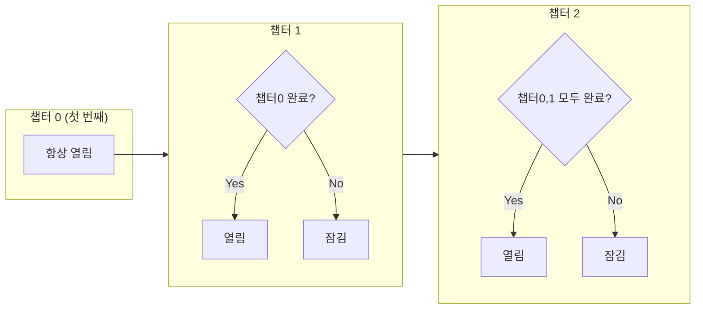
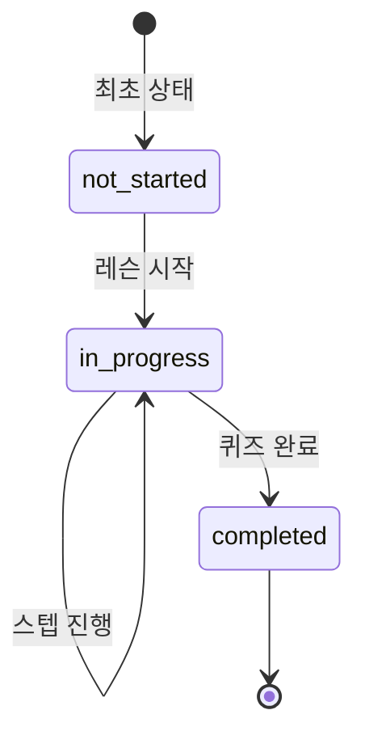
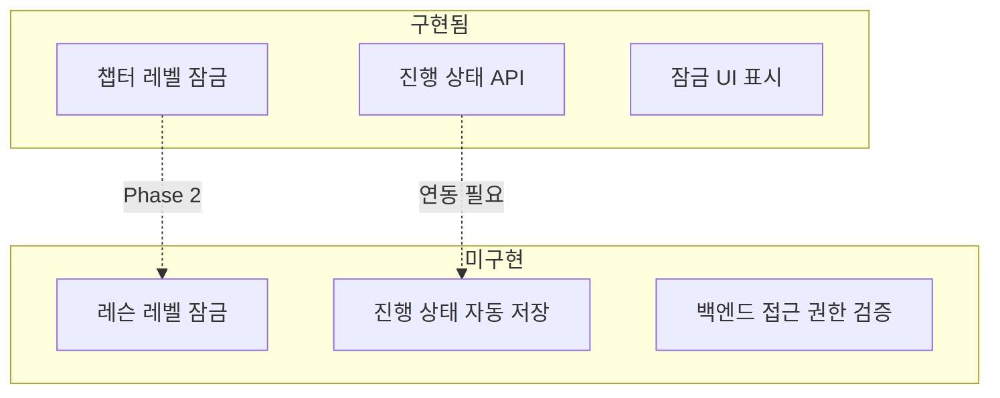

# 콘텐츠 잠금(Lock) 로직

> 코스/챕터/레슨의 순차적 잠금 해제 시스템

---

## 1. 전체 흐름도



---

## 2. 챕터 잠금 조건



### 잠금 조건 코드

```typescript
// LanguageCoursePage.tsx (258-272줄)

// 이전 챕터들이 모두 완료되었는지 확인
const previousChaptersComplete = chapters.slice(0, index).every(ch => {
  const completedInChapter = ch.lessons.filter(
    l => progressMap.get(l.id)?.status === 'completed'
  ).length;
  return completedInChapter === ch.lessons.length;
});

// 현재 챕터 진행률
const completedInChapter = chapter.lessons.filter(
  l => progressMap.get(l.id)?.status === 'completed'
).length;

const isComplete = completedInChapter === chapter.lessons.length && chapter.lessons.length > 0;
const isLocked = index > 0 && !previousChaptersComplete && completedInChapter === 0;
const isActive = !isComplete && !isLocked && (index === 0 || previousChaptersComplete);
```

---

## 3. 진행 상태 시스템



### UserProgress 타입

```typescript
{
  userId: string;
  lessonId: string;
  status: 'not_started' | 'in_progress' | 'completed';
  currentStep: number;
  quizScore?: number;
  quizTotal?: number;
  startedAt: Date;
  completedAt?: Date;
}
```

---

## 4. 구현 현황



---

## 5. 핵심 파일 위치

| 파일 | 줄 | 역할 |
|------|-----|------|
| `packages/frontend/src/features/courses/LanguageCoursePage.tsx` | 258-272 | `isLocked` 계산 로직 |
| `packages/frontend/src/features/courses/components/ChapterCard.tsx` | 16, 25, 42 | 잠금 UI 렌더링 |
| `packages/frontend/src/features/courses/components/LessonCard.tsx` | 19, 41 | 진행 상태 표시 |
| `packages/frontend/src/services/courses.ts` | 172-211 | 진행 상태 API |
| `packages/backend/src/modules/courses/routes.ts` | 101-215 | 진행 상태 엔드포인트 |

---

## 6. ChapterCard UI 로직

```typescript
// ChapterCard.tsx

const handleClick = () => {
  if (!isLocked) {
    navigate(`/courses/${languageId}/${chapter.id}`);
  }
};

// 스타일
className={`
  ${isLocked
    ? 'bg-[#252535] border border-white/5 opacity-60 cursor-not-allowed'
    : 'bg-gradient-to-br from-[#1a1a2e] to-[#16213e] border border-white/10 hover:border-[#00D9FF]/50'
  }
`}

// 잠금 아이콘 표시
{isLocked && <Lock className="w-4 h-4 text-white/40" />}
```

---

## 7. API 엔드포인트

### 진행 상태 조회
```
GET /api/courses/progress
Authorization: Bearer {token}

Response: UserProgress[]
```

### 진행 상태 업데이트
```
POST /api/courses/progress
Authorization: Bearer {token}

Body: {
  lessonId: string;
  status?: 'not_started' | 'in_progress' | 'completed';
  currentStep?: number;
  quizScore?: number;
  quizTotal?: number;
}

Response: UserProgress
```

---

## 8. 모든 콘텐츠 오픈하려면

`LanguageCoursePage.tsx`에서 `isLocked`를 항상 `false`로 변경:

```typescript
// 변경 전
const isLocked = index > 0 && !previousChaptersComplete && completedInChapter === 0;

// 변경 후
const isLocked = false;
```

---

## 9. Phase 2 계획

1. **레슨 레벨 잠금** - 이전 레슨 완료 후 다음 레슨 잠금 해제
2. **진행 상태 자동 저장** - 스텝 진행 시 자동 업데이트
3. **백엔드 접근 권한 검증** - URL 직접 접근 방지
